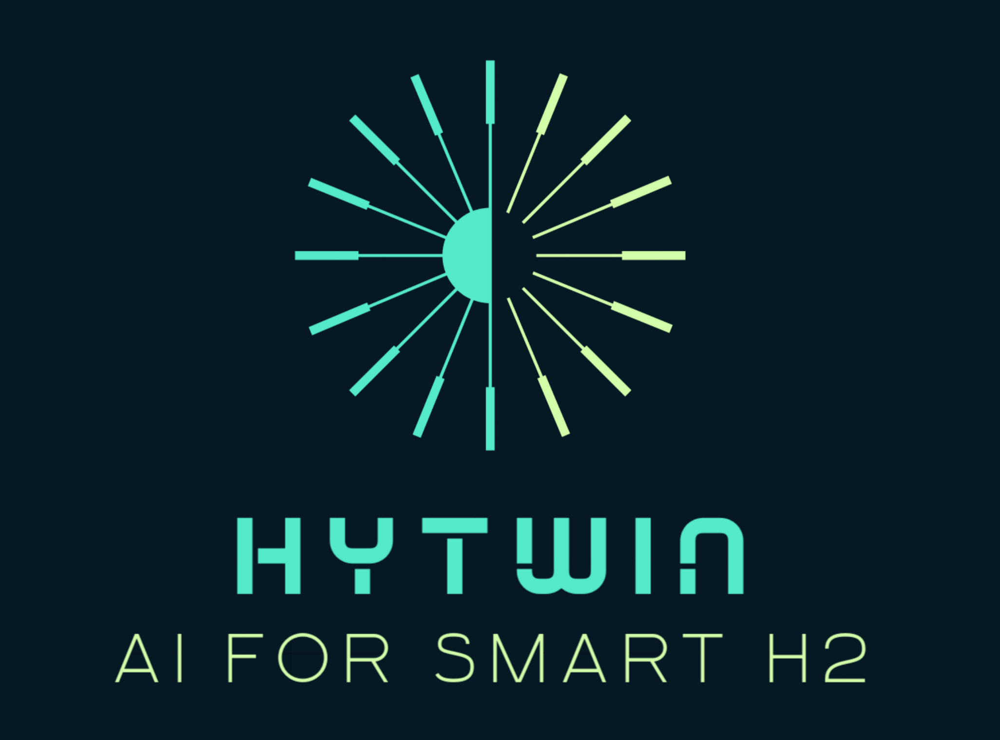

# HyTwin 2.0 — AI-Controlled Digital Twin for a Multi-Node H2 Energy Network

HyTwin 2.0 is a modular, scalable digital-twin framework for a
**geographically distributed hydrogen (H₂) energy network** — physics-based
component models, virtual sensors with realistic measurement artifacts, an
explicit multi-site dispatch layer, reinforcement-learning-based network
control, and a real-time "Network Control Room" web dashboard. The flagship
scenario is a 7-node Italian network spanning producer sites in the sunny,
windy south and islands (Trapani, Cagliari, Taranto) and consumer sites in
the industrial north (Napoli, Roma, Bologna, Milano), linked by electric
lines and H₂ pipelines.

A single-site plant is simply a network with one site and no links — the
original single-site simulation, RL, and dashboard remain available as a
lighter-weight secondary path.

---

## Architecture overview

```
hytwin/
├── core/               Event bus · State manager · Simulation clock · Registry
├── models/             Wind turbine · PV array · Electrolyzer · Fuel cell
│                       Hydrogen tank · Energy load · Grid connection · Energy cost
├── sensors/             Base sensor pipeline (noise, drift, delay, quantisation,
│                       faults) · concrete sensor types · SensorManager
├── weather/             Stochastic weather model (Weibull wind, solar geometry,
│                       cloud cover, temperature AR(1)), WeatherField (spatial
│                       correlation across sites via Cholesky-decomposed
│                       geographic correlation + shared synoptic AR(1) process)
├── digital_twin/       TwinNode (model + sensor fusion, anomaly/health scoring)
│                       GridTwin (single-site aggregation)
├── network/             NetworkTopology/SiteSpec/LinkSpec (multi-site topology,
│                       auto great-circle link lengths), NetworkState, dispatch
│                       (L1 greedy merit-order), NetworkTwin (multi-site
│                       orchestrator), compare.py (reproducible comparison harness)
├── rl/                  H2GridEnv · AdvancedH2GridEnv (single-site Gymnasium envs)
│                       NetworkRLEnv (multi-site, per-node factored obs/action)
│                       RLTrainer (SB3) · network_trainer.py
├── control/             ClassicalController (cost-aware rule-based dispatch)
│                       RLController · NetworkController (network-aware overlay:
│                       electric-transport-first, green-H2-first dispatch)
│                       NetworkRLController
├── simulation/          SimulationEngine · Scenario (YAML, single-site or
│                       network: block)
├── data/                TimeSeriesRecorder (memory + CSV)
├── visualization/       Dashboard plots · Sensor comparison plots
└── dashboard/           FastAPI + WebSocket real-time web dashboards:
                        network_app.py (multi-node "Network Control Room" —
                        the primary, recommended dashboard) + a legacy
                        single-site dashboard reachable via demo_advanced.py
```

Full design rationale and equations: [`docs/`](docs/index.md), starting
with [`docs/01_architecture.md`](docs/01_architecture.md).

---

## Quick start — Network Control Room (recommended)

```bash
# 1. Create a virtual environment and install dependencies
python -m venv .venv
source .venv/bin/activate
pip install -r requirements.txt
# — or, for an editable install —
pip install -e ".[dev,extras]"

# 2. Launch the multi-node Network Control Room dashboard
python -m dashboard.network_app --speed-factor 30
# then open http://localhost:8060 and press "Start"

# 3. Or, compare traditional vs. AI control from the CLI
python -c "
from hytwin.simulation.scenario import Scenario
from hytwin.network.compare import compare_controllers
topo = Scenario.from_yaml('config/italy_network_large.yaml').topology()
out = compare_controllers(topo, steps=1008, seed=42,
                           strategies={'none': 'none', 'classical': 'classical'})
for name, kpis in out.items():
    print(name, kpis)
"

# 4. Run the test suite
pytest tests/ -v
```

CLI options for the dashboard: `--config <path>`, `--port`, `--dt`,
`--speed-factor`, `--seed`, `--rl-model`. Default network:
`config/italy_network_large.yaml` (7 sites, 12 links).

For the complete, copy-pasteable workflow — running simulations, training
an AI agent, running comparisons, varying time horizon/seed/network config,
and interpreting the results — see
**[`docs/09_usage_guide.md`](docs/09_usage_guide.md)**.

---

## Component models

| Component | Physics |
|-----------|---------|
| **WindTurbineModel** | Analytical Cp/TSR curve, Weibull wind, ISA air density, hub-height shear |
| **PhotovoltaicModel** | NOCT cell temp, ASHRAE IAM, inverter efficiency curve, tilt/azimuth irradiance |
| **ElectrolyzerModel** | PEM Butler-Volmer, Faradaic efficiency, Faraday's law, ramp-rate |
| **FuelCellModel** | PEM Tafel/ohmic/concentration polarisation, Nernst OCV, H₂ utilisation |
| **HydrogenTankModel** | Van der Waals EOS, SOC/pressure, boil-off |
| **EnergyLoadModel** | Diurnal+seasonal profiles per demand type, weekday/weekend/Italian-holiday factors (incl. August industrial shutdown), dual-hump seasonal curve for heating+AC |
| **GridConnectionModel** | Import/export limits, stochastic outages, ramp-rate, carbon factor |
| **EnergyCostModel** | Italian PUN F1/F2/F3 tariff structure, Italian national holiday calendar (incl. Easter/Pasquetta), merit-order renewable-abundance price discount, daily noise, seasonal trend, price spikes |
| **ElectricLineModel** / **H2PipelineModel** | Inter-site links: resistive loss / compression energy, capacity, ramp-rate, transport delay & line-pack |

Weather realism: per-site seasonal+diurnal wind climatology, seasonally-
modulated cloud cover with proper AR(1) mean-reversion, synoptic coupling
(storms boost wind and cloud together), and — across a network —
`WeatherField` correlates sites' weather by geographic distance
(Cholesky-decomposed correlation matrix, 300 km default correlation length)
plus a shared synoptic AR(1) process.

---

## Virtual sensor pipeline

Each virtual sensor passes a true physical value through noise → drift →
delay → quantisation → fault injection → quality scoring, producing one of
five statuses: **OK / DEGRADED / FAULT_STUCK / FAULT_SPIKE / FAULT_OFFLINE**,
each with a tunable per-sensor **`fault_probability`**. The digital twin's
anomaly score is a **scale-free relative deviation** (a fraction of the
model's expected value, not a fixed absolute-unit threshold), so it behaves
consistently whether the sensor measures kW, bar, or a 0–1 SOC fraction. The
dashboard's Events & Alarms log reports the specific worst-offending
component (site + device id + device kind), the fault kind in plain English
("outlier spike", "stuck reading", "sensor offline", "reading drifted from
model estimate"), and the measured vs. model-expected value where
available — see [`docs/04_virtual_sensors.md`](docs/04_virtual_sensors.md).

---

## Reinforcement learning

| Environment | Scope | Notes |
|-------------|-------|-------|
| `H2GridEnv` / `AdvancedH2GridEnv` | single site | 14-D/19-D obs, 3-D/4-D actions |
| `NetworkRLEnv` (`NetworkH2GridEnv`) | multi-site network | per-node factored observation/action blocks, scales with site/link count |

- **Reward** (`NetworkRewardConfig`): a multi-term weighted reward —
  self-sufficiency, renewable fraction, grid economics, unmet-demand
  (linear + quadratic + event penalty), curtailment penalty, and an
  **H₂ storage-value term** that credits/debits tank-mass changes at
  ≈4 €/kg so the agent can't fake a low cost by draining storage. There is
  no fixed "optimal" reward — it's an unbounded weighted sum whose range
  depends on the episode's weather/price draw; the right benchmark is
  relative performance vs. the classical/naive controllers on the same
  seed, and the *trend* of the learning curve, not its absolute value.
- **Algorithms**: PPO (primary, Stable-Baselines3) for both single-site and
  network envs; SAC/TD3/DDPG also available for the single-site envs.
- **Training**: `train_network_agent()` (network) / `RLTrainer` (single-site).
- **Classical baseline**: `NetworkClassicalController` — a network-aware
  overlay (electric-transport-first, green-H₂-first dispatch) on top of the
  per-site `ClassicalController`, for side-by-side comparison against
  trained RL agents.

Details and results: [`docs/06_reinforcement_learning.md`](docs/06_reinforcement_learning.md),
[`docs/05_network_layer.md`](docs/05_network_layer.md).

---

## Network Control Room dashboard

```bash
python -m dashboard.network_app --speed-factor 30
# then open http://localhost:8060
```

A professional SCADA/EMS-style control room for the full multi-site
Italian H₂ network, with 9 screens in the sidebar:

**Overview** (KPI tiles + sparklines) · **Network & Map** (animated
"big-pixel" tile map of Italy with the real topology's sites/links plotted
from live lat/lon data; click a node for a live device drawer) ·
**Analytics & KPIs** (KPI history charts) · **Control & AI** (live-switch
the controller: `none` / `classical` / `rl`, with a live reward-term
breakdown) · **Scenario Comparison** (batch and live-lockstep
none/classical/rl comparison on identical conditions) · **AI Training**
(background PPO job with live progress, ETA, and learning-curve chart;
activate a freshly trained model live, with automatic observation-space
compatibility validation) · **Events & Alarms** (redesigned: names the
specific faulty component and fault kind in plain English, dead-banded
thresholds with explicit clear events) · **Diagnostics** (per-component
health/anomaly/sensor-quality heatmap) · **Configuration** (a scenario YAML
editor — validated by round-tripping through the real parser before saving;
this is how you add nodes, edit component parameters, or tune sensor fault
frequencies, entirely from the UI, with no restart needed).

The simulation is **built but paused** on launch — press **Start** to begin;
the sidebar always shows an explicit RUNNING / PAUSED state.

Full screen-by-screen reference: [`docs/07_dashboard.md`](docs/07_dashboard.md).

A legacy single-site dashboard remains available via
`python demos/demo_advanced.py --mode dashboard --port 8050`.

---

## Configuration

Scenarios are YAML files under `config/`. Six ship with the repo:
`italy_network_large.yaml` (flagship 7-node network, the default),
`italy_network_pilot.yaml` (3-node, used in RL tests), and four legacy
single-site scenarios (`default_grid.yaml`, `advanced_grid.yaml`,
`advanced_stress.yaml`, `pilot_scenario.yaml`).

```yaml
network:
  sites:
    - id: trapani
      location: { name: "Trapani", lat: 37.98, lon: 12.51, alt_m: 20 }
      weather: { weibull_k: 2.2, weibull_c: 7.2, cloud_cover_mean: 0.20, ... }
      energy_cost: { f1_price: 0.23, f2_price: 0.15, f3_price: 0.08, ... }
      grid:
        wind_turbines:  [ { id: trapani_wt1, params: { rated_power_kw: 500, ... } } ]
        pv_arrays:      [ ... ]
        electrolyzers:  [ ... ]
        hydrogen_tanks: [ ... ]
        loads:          [ ... ]
        grid_connections: [ { id: trapani_grid, params: { max_import_kw: 400, ... } } ]
    - id: napoli
      ...
  links:
    - { id: trapani_napoli_h2, type: h2_pipeline, from: trapani, to: napoli,
        params: { max_flow_kg_h: 300, compressor_spec_kwh_per_kg: 2.2 } }
    - { id: trapani_napoli_elec, type: electric_line, from: trapani, to: napoli,
        params: { max_power_mw: 40, loss_per_1000km: 0.06 } }
```

Add a node by duplicating a `- id: ...` site block under `network.sites`
and giving it a new id; tune sensor fault frequency via each sensor's
`fault_probability`. A file without a `network:` block is treated as a
legacy single-site scenario automatically.

Full schema reference: [`docs/08_configuration_reference.md`](docs/08_configuration_reference.md).

---

## Validation

| Check | Result |
|-------|--------|
| Unit tests (`pytest tests/`) | **168 / 168 PASS** |

Coverage: digital twin, link models, component models, network controller,
network dashboard, network RL, network topology, network twin, RL
environment, sensors, weather/cost realism.

---

## Legacy single-site demos

```bash
python demos/demo_simulation.py --plot
python demos/demo_sensors.py --plot
python demos/demo_digital_twin.py --plot
python demos/demo_rl_training.py --timesteps 20000 --plot
python demos/demo_advanced.py --mode simulate --steps 144
python demos/demo_advanced.py --mode compare --steps 144
python demos/demo_advanced.py --mode train_rl --timesteps 100000
python demos/demo_advanced.py --mode dashboard --port 8050
```

---

## Documentation

Full technical documentation lives in [`docs/`](docs/index.md):

1. [`01_architecture.md`](docs/01_architecture.md) — system architecture
2. [`02_physical_models.md`](docs/02_physical_models.md) — physics & equations
3. [`03_digital_twin.md`](docs/03_digital_twin.md) — TwinNode/GridTwin fusion
4. [`04_virtual_sensors.md`](docs/04_virtual_sensors.md) — sensor pipeline & faults
5. [`05_network_layer.md`](docs/05_network_layer.md) — multi-site topology, dispatch, control
6. [`06_reinforcement_learning.md`](docs/06_reinforcement_learning.md) — RL envs & reward design
7. [`07_dashboard.md`](docs/07_dashboard.md) — Network Control Room reference
8. [`08_configuration_reference.md`](docs/08_configuration_reference.md) — full YAML schema
9. [`09_usage_guide.md`](docs/09_usage_guide.md) — **how to use HyTwin**, start here

---

## Reference

This framework builds on experience from the HYTWIN 1.x series and
supersedes earlier single-site prototypes with full physics models, a
virtual sensor layer, model-sensor state fusion, a Gymnasium RL environment
extended to full network scale, an explicit multi-site dispatch layer, and
the Network Control Room real-time dashboard.
